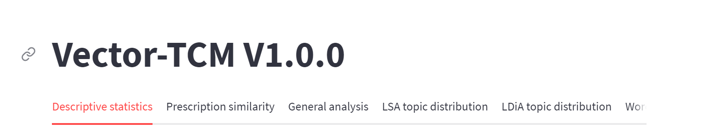
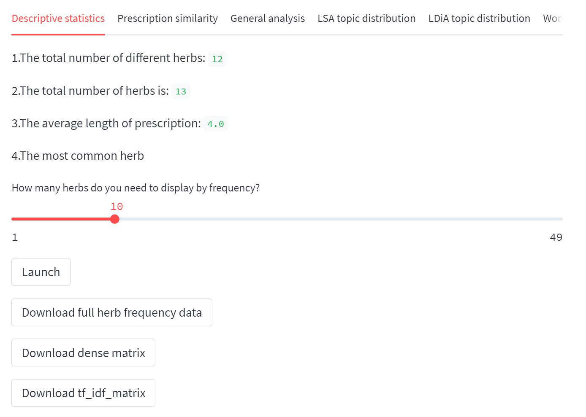
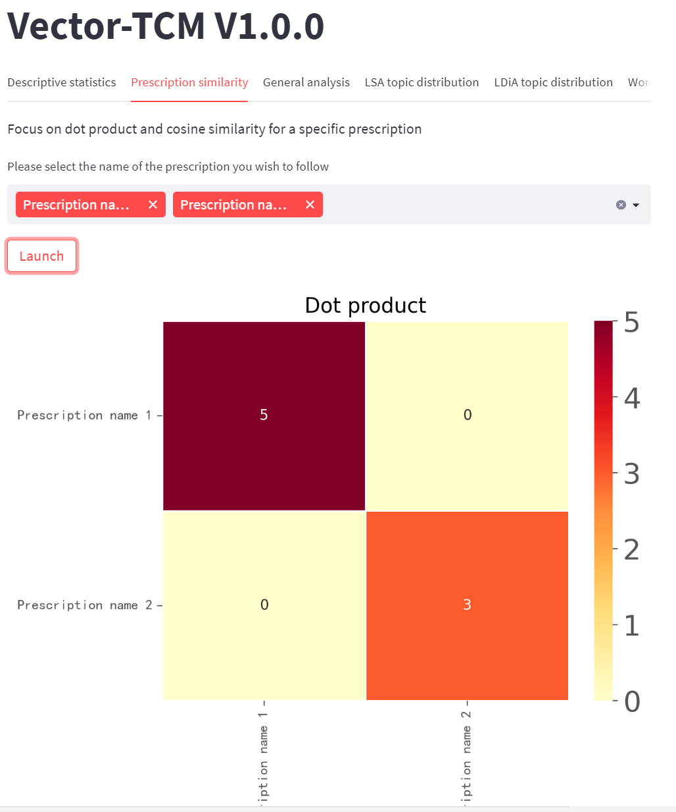
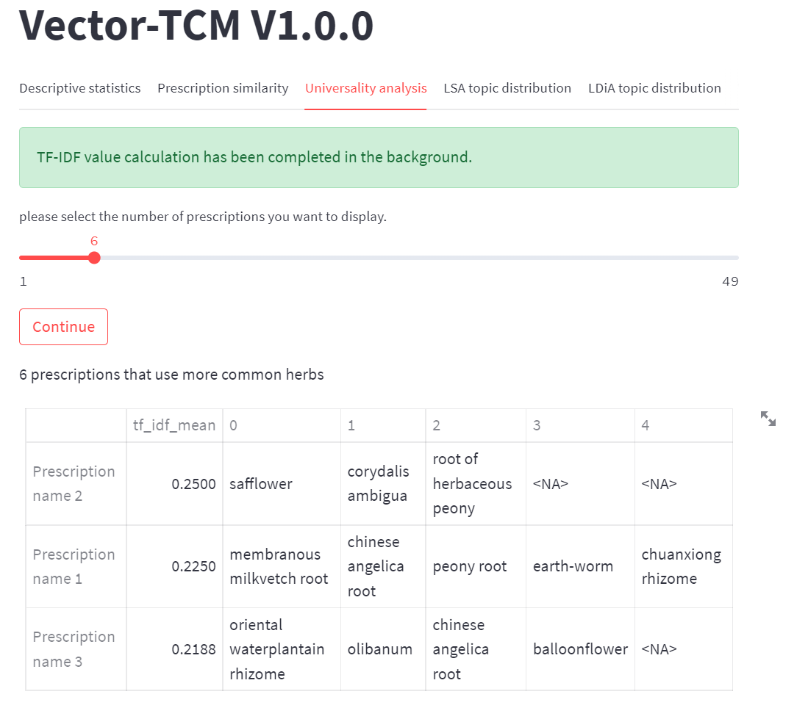

# 
 Vector-TCM 

Vector-TCM is a platform for traditional Chinese medicine (TCM) data mining. It uses text vector as the basic data form and natural language processing (NLP) technology for TCM data mining.

1. Original data form
The original data must be submitted as a text vector, as shown in the following example:

| index | text|
|-------|---|
|Prescription name|herb name1, herb name2, herb name3, ...|

Note: 1.Only .xlsx format worksheets are supported.  
2.the interval between herb names must be commas in English format. if your original data 
is not like this, it is recommended to use regular expressions to adjust it.  
3.There is no limit to the naming of the title row of the worksheet, but there must be this row.  
4.Provide sample data download, you can imitate the sample data to arrange your own data.  

2. Data preprocessing
<kbd>

</kbd>
You can select different modules at the top to start different analysis.

2.1 Descriptive statistics
<kbd>

</kbd>
The role of this module is no different from conventional descriptive statistics and is used to understand the basic information of the data set.

2.2 Prescription similarity
<kbd>

</kbd>
The Prescription similarity module is used to analyze the similarity between prescriptions in the data set. The algorithm of the module is based on the dot product value and cosine value. Due to the limitation of computing power, in the WebAPP version of the Vector-TCM, it is not possible to directly calculate the similarity of prescriptions in the entire data set. You need to select a part of the prescription calculation.

2.3 Universality analysis
<kbd>

</kbd>
In NLP, words with high TF-IDF values are often considered to be of analytical value. In TCM data mining, TF-IDF value will be more fully utilized. Herbs with low TF-IDF values mean that they are widely used in datasets. We can combine descriptive statistics to more strongly prove that they are necessary herbs for the treatment of certain diseases, or that some doctor is accustomed to using herbs; herbs with high TF-IDF values are herbs that only appear once in all prescriptions in the data set. In addition to certain rare herbs, they can also reverse verify the quality of data cleaning, so that we can find those herbal names that have not been unified, or other abnormal terms. Since each herb appears only once in each prescription, the same herb has the same TF-IDF value anywhere in the data set. We can average the TF-IDF values of all herbs in each prescription. The high mean reflects that more rare herbs are used in this prescription. The special treatment concept of these prescriptions deserves more in-depth study. The low mean reflects that it uses common herbs, and these prescriptions represent the general treatment concept of this disease or this doctor. 